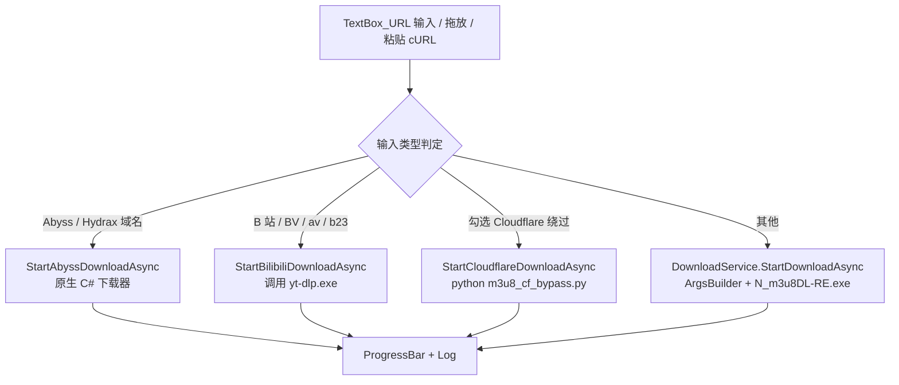
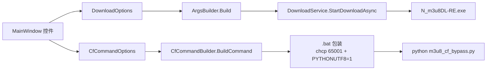
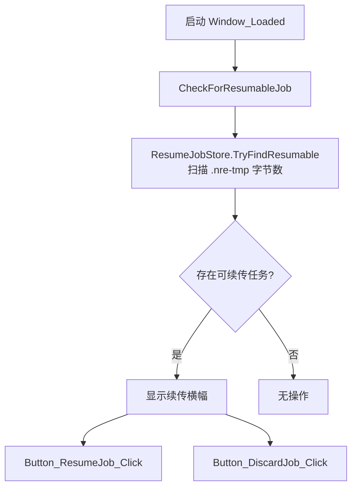

# N_m3u8DL_RE_GUI 架构说明（汉化增强版）

> 本文档描述本仓库（基于 [naravid19/N_m3u8DL_RE_GUI](https://github.com/naravid19/N_m3u8DL_RE_GUI)）的代码结构与数据流。
> 技术名词保留英文（MVVM、DI、WPF、CLI、HLS、DASH、MSS、DRM 等）。

---

## 1. 概述

N_m3u8DL_RE_GUI 是一个 WPF 桌面 GUI，封装命令行下载器 **N_m3u8DL-RE**（负责 HLS / DASH / MSS / DRM 等流媒体的实际下载、解密、混流），并额外集成：

- **FFmpeg**：转码 / 混流 / 分片合并 / 探测；
- **m3u8_cf_bypass.py**：Cloudflare WAF 绕过（curl_cffi + TLS 指纹）；
- **yt-dlp**：B 站等站点下载（本仓库新增）；
- **原生 C# 下载器（Abyss / Hydrax）**：部分直链站点免外部进程下载；
- **浏览器扩展（N-RE Stream Bridge）**：抓取页面请求，导出 cURL / HAR / 指令，回填 GUI。

GUI 本身不做下载，只做参数编排、进程调度、日志展示与配置持久化。实际工作由外部二进制完成。

## 2. 技术栈

| 项目 | 技术 |
| --- | --- |
| GUI | C# 13 / .NET 9（`net9.0-windows`）/ WPF / WindowsForms 互操作 |
| MVVM | CommunityToolkit.Mvvm 8.4.0（`ObservableObject`、`[RelayCommand]`） |
| DI | Microsoft.Extensions.DependencyInjection 9.0.8 |
| Core | .NET 9（`net9.0`，纯逻辑、无 WPF 依赖） |
| Tests | xUnit，`N_m3u8DL_RE_GUI.Tests` |
| 扩展 | 浏览器 Manifest V3（Chromium）/ nativeMessaging / popup |

## 3. 解决方案结构

```
gui/
├── N_m3u8DL_RE_GUI.sln
├── Directory.Build.props            # 单一版本号来源 <AppVersion>
├── N_m3u8DL-RE.exe                  # 外部依赖（上游随仓库分发）
├── ffmpeg.exe                       # 外部依赖（上游随仓库分发）
├── m3u8_cf_bypass.py                # Cloudflare 绕过脚本（本仓库重写）
├── yt-dlp.exe                       # B 站支持（本仓库新增）
├── N_m3u8DL_RE_GUI/                 # WPF 前端
├── N_m3u8DL_RE_GUI.Core/            # 纯逻辑层（CLI 构造、解析、断点续传）
├── N_m3u8DL_RE_GUI.Tests/           # 单元 / 集成测试
└── extension/                       # 浏览器扩展 v1.4.5
```

### 3.1 N_m3u8DL_RE_GUI（WPF 前端）

| 文件 | 职责 |
| --- | --- |
| `App.xaml` / `App.xaml.cs` | 应用入口；注册全局异常处理（Dispatcher / AppDomain / TaskScheduler），`ViewModelLocator.Initialize()` 启动 DI |
| `MainWindow.xaml` | 主窗口 UI（多 Tab：下载 / 安全（KEY）/ 媒体 / 直播 / 高级 / Cloudflare / 更新） |
| `MainWindow.xaml.cs` | 交互逻辑：参数收集、输入分流、进程启动、日志节流、断点续传横幅、拖放、剪贴板 cURL 解析、B 站 / Abyss / CF 分支 |
| `Views/StreamPickerWindow.xaml(.cs)` | Abyss / Hydrax 清晰度选择弹窗 |
| `Converters/BooleanToVisibilityConverter.cs` | 布尔转可见性转换器 |
| `Fonts/KingHwaOldSong-GJ.ttf` | 可选内嵌字体（京華老宋体-GJ）；`<Resource>` 带 `Condition="Exists(...)"`，缺失时构建仍成功 |
| `Services/*` | 见 §3.4 |
| `ViewModels/MainViewModel.cs` | MVVM ViewModel：下载命令、日志、URL→标题 |
| `ViewModels/ViewModelLocator.cs` | 静态 DI 容器定位器 |

### 3.2 N_m3u8DL_RE_GUI.Core（纯逻辑）

| 文件 | 职责 |
| --- | --- |
| `ArgsBuilder.cs` | 把 `DownloadOptions` 编译成 N_m3u8DL-RE 的 CLI 参数串（Windows 参数转义） |
| `DownloadOptions.cs` | 与 CLI 一一对应的选项 DTO |
| `CfCommandBuilder.cs` | 编译 Cloudflare 绕过命令（python + 脚本），生成 `.bat` 包装 |
| `ConsoleOutputParser.cs` | 解析子进程输出，提取进度百分比、清洗 ANSI |
| `BatchInputParser.cs` | 解析批量输入文件（URL#标题 行） |
| `DropInputRules.cs` | 判定拖入文件类型（URL / HAR / cURL / mux.json） |
| `HtmlTitleExtractor.cs` | 从 HTML 提取 `<title>` |
| `InputValidation.cs` | 输入合法性校验 |
| `LegacyConfigCodec.cs` | 旧版 `config.txt` 编解码 |
| `OptionValueNormalizer.cs` | 选项值规整（保存目录、路径清洗等） |
| `TextEncodingDetector.cs` | 非 UTF-8 文本编码探测（GBK 等） |
| `Abyss/*` | Abyss / Hydrax 原生下载（加密、元数据、下载服务、模型） |
| `Capture/*` | 请求捕获：cURL 解析、HAR 提取、Header 策略、批量粘贴 |
| `Resume/*` | 断点续传模型与路径解析（`ResumeJob`、`ResumePaths`） |
| `Services/*` | `GitHubUpdateCheckService`：更新检查（三态：有更新 / 最新 / 未知） |

### 3.3 N_m3u8DL_RE_GUI.Tests

- `Core\*`、`Services\*`、`ViewModels\*`、`UI\*`（XAML 可访问性 / 对比度测试）；
- `Integration\LiveStreamValidationTests.cs`、`Fixtures\Har\*.har`。

### 3.4 GUI Services

| 服务 | 职责 |
| --- | --- |
| `IDownloadService` / `DownloadService` | 进程调度核心：`StartDownloadAsync`（经 `ArgsBuilder` 构造并运行 N_m3u8DL-RE）、`StartProcessAsync`、`StartTrackedProcessAsync`（单进程锁、UTF-8 标准输出转发、进度解析、结束 100%）、`StopDownload`（取消 CTS + 杀进程树） |
| `IUtilityService` / `UtilityService` | 通用工具（文件名清洗、打开文件夹、文件夹选择等） |
| `IDragDropService` / `DragDropService` | 拖放解析 |
| `IConfigService` / `JsonConfigService` | JSON 配置读写；自动迁移旧 `config.txt`；DPAPI 加密敏感项（Headers / Proxy / HLS Key / IV） |
| `ConfigService` | 旧版分号 `config.txt` 解析 |
| `IBatchScriptService` / `BatchScriptService` | 批量脚本生成（从目录枚举 `.m3u8/.mpd` 或从文本文件解析） |
| `AppConfigState` | 键值状态容器（含旧版键名映射） |
| `MainWindowConfigMapper` | `MainWindow` 控件 ↔ `AppConfigState` 的捕获 / 还原 |
| `ResumeJobStore` | 断点续传记录（`%LOCALAPPDATA%\N_m3u8DL_RE_GUI\active-job.json`，只存 host 不存 URL） |

### 3.5 extension（浏览器扩展 v1.4.5）

- `manifest.json`、`background.js`、`content.js`、`deep-detect.js`；
- `popup/`（弹窗 UI）、`lib/`（分类、Cookie、cURL 生成、Header 策略、nativeMessaging、探针、更新检查等）、`test/`。

扩展通过 nativeMessaging 把捕获到的请求（cURL / HAR / `# nre-*` 指令）发送给 GUI。

## 4. 数据流

### 4.1 主下载流程（输入分流）



### 4.2 CLI 构造链路



### 4.3 Cloudflare 绕过脚本交互

`BuildCfOptions`（`MainWindow.xaml.cs`）把 UI 字段映射为 `CfCommandOptions`：

- `SegDir` = `保存目录\cf_segments`；
- `Threads` = 最大并发数（`TextBox_Max`，默认 16）；
- `Proxy` = `TextBox_Proxy`；
- `Impersonate` = `Combo_CFImpersonate`（默认 chrome）；
- `KeepSegments` = `CheckBox_CFKeepSegs`；
- `Referer` = `TextBox_CFReferer`（否则由 URL 推导）。

`CfCommandBuilder` 生成命令行 → `BuildBatchScript` 生成 UTF-8 的 `.bat` → 写入 `%TEMP%\cf_dl_<ts>.bat` → `DownloadService.StartProcessAsync` 运行。
脚本内部：自动代理（env / Windows 注册表 → Clash `http://127.0.0.1:7897`）、并发分片下载（`ThreadPoolExecutor`，每线程独立 `curl_cffi` Session）、断点续传（复用 `*.ts`、`.part` 原子写、`cf_manifest.txt` URL 变更自动清空）。

### 4.4 断点续传



`ResumePaths` 解析临时目录优先级：用户指定 > 匹配的历史任务目录 > 由 `saveDir`+`saveName` 推导。`SanitizeSaveName` 处理非法字符、Windows 保留设备名（CON/PRN/AUX/NUL/COM1-9/LPT1-9）、长度上限（50 字符 + SHA256 后缀）。**续传记录只保存 host，不保存流 URL。**

## 5. 关键方法索引（MainWindow.xaml.cs）

| 方法 | 行 | 职责 |
| --- | --- | --- |
| `Button_GO_Click` | 1058 | 主入口：参数收集 + 输入分流调度 |
| `StartAbyssDownloadAsync` | 1372 | Abyss / Hydrax 原生下载 |
| `IsBilibiliInput` / `NormalizeBilibiliInput` | 1457 / 1469 | B 站输入识别与归一化 |
| `StartBilibiliDownloadAsync` | 1487 | 调用 yt-dlp.exe 下载 B 站 |
| `BuildCfOptions` | 1557 | 构造 CF 命令选项 |
| `FindPythonWithCurlCffiAsync` | 1598 | 探测可 `import curl_cffi` 的 Python |
| `StartCloudflareDownloadAsync` | 1737 | 运行 CF 绕过脚本 |
| `AppendLog` / `FlushLog` | 1014 / 1027 | 日志节流（`MaxLogChars=80000`，200ms 刷新） |
| `InitializeFontFeature` | — | 初始化字体选择器：内置字体（可选）+ 系统字体枚举，还原 `UIFont` |
| `ApplyFontSource` | — | 应用字体源到根窗口（失败回退 `Microsoft YaHei UI`） |
| `Button_ImportFont_Click` | — | 导入本地 `.ttf/.otf/.ttc` 并应用 |
| `Combo_UIFont_SelectionChanged` | — | 下拉选择字体并应用 |
| `CheckForResumableJob` | 769 | 启动续传检测 |
| `Button_ResumeJob_Click` | 827 | 执行续传 |
| `ImportFromHar` | 648 | 导入 HAR |

## 6. 外部二进制与依赖

| 二进制 | 用途 | 备注 |
| --- | --- | --- |
| `N_m3u8DL-RE.exe` | HLS/DASH/MSS/DRM 下载器 | 随仓库 / Release 分发 |
| `ffmpeg.exe` | 转码 / 混流 / 合并 / 探测 | 随仓库 / Release 分发 |
| `yt-dlp.exe` | B 站等站点下载 | 本仓库新增，随 Release 分发 |
| `m3u8_cf_bypass.py` | Cloudflare 绕过 | 需 Python + `pip install curl_cffi` |

上述四个文件在 `.csproj` 中配置为 `CopyToPublishDirectory=PreserveNewest` + `ExcludeFromSingleFile=true`（不打包进单文件 exe，与主程序同目录发布）。

## 7. 构建与发布

### 7.1 环境

- .NET 9 SDK；
- （仅 CF 绕过需要）Python 3 + `pip install curl_cffi`。

### 7.2 构建（PowerShell）

```powershell
$env:DOTNET_CLI_TELEMETRY_OPTOUT=1
$env:DOTNET_NOLOGO=1

dotnet build .\N_m3u8DL_RE_GUI\N_m3u8DL_RE_GUI.csproj -c Release
```

### 7.3 发布（自包含单文件）

```powershell
dotnet publish .\N_m3u8DL_RE_GUI\N_m3u8DL_RE_GUI.csproj `
  -c Release -r win-x64 --self-contained true `
  -p:PublishSingleFile=true `
  -p:IncludeNativeLibrariesForSelfExtract=true `
  -p:EnableCompressionInSingleFile=true
```

发布产物目录包含主程序单文件 + 四个外部二进制 + 配置模板（若存在可选字体文件则一并包含）。

> 版本号唯一来源为 `Directory.Build.props` 的 `<AppVersion>`；`Version` / `AssemblyVersion` / `FileVersion` 由此派生，构建后还会写入 `extension/suite-version.json`。
